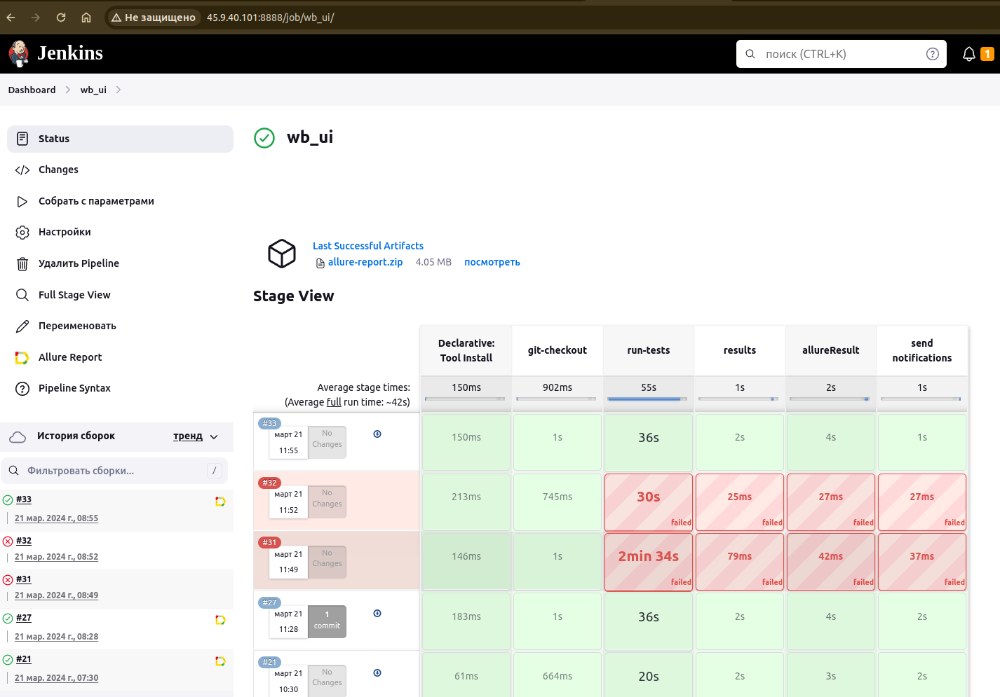
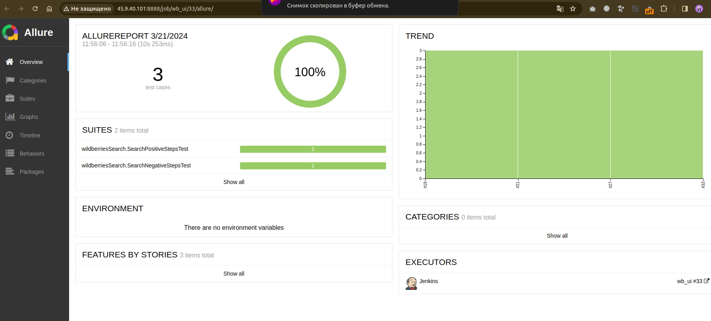
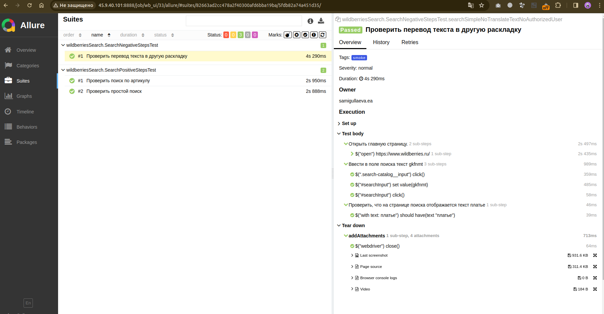
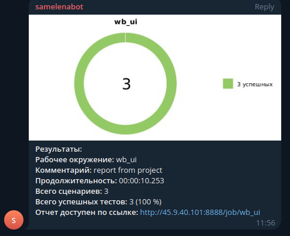

# Дипломный проект по тестированию поисковой строки интернет-магазина [WILDBERRIES](https://www.wildberries.ru/)

## :open_book: Содержание:

- [Технологии и инструменты](#gear-технологии-и-инструменты)
- [Тест кейсы](#heavy_check_mark-Тест-кейсы)
- [Запуск тестов](#computer-запуск-тестов-из-терминала)
- [Примеры использования](#примеры-использования)
- [Запуск тестов в Jenkins](#-запуск-тестов-из-jenkins)
- [Отчет о результатах тестирования в Allure Report](#-отчет-о-результатах-тестирования-в-Allure-report)
- [Уведомления в Telegram](#-уведомления-в-telegram)
- [Видео прохождения тестов](#movie_camera-видео-с-прогоном-тестов)

## :gear: Технологии и инструменты

<p align="left">
<a href="https://www.jetbrains.com/idea/"></a>
<a href="https://www.java.com/"></a>
<a href="https://github.com/"></a>
<a href="https://junit.org/junit5/"></a>
<a href="https://gradle.org/"></a>
<a href="https://selenide.org/"></a>
<a href="https://aerokube.com/selenoid/"></a>
<a href="https://github.com/allure-framework/allure2"></a>
<a href="https://www.jenkins.io/"></a>
<a href="https://web.telegram.org/"></a>
</p>

В данном проекте автотесты написаны на **Java** с использованием фреймворка для тестирования **Selenide**. Для сборки проекта в среде **IntelliJ IDEA** используется **Gradle**.
**JUnit5** задействован в качестве фреймворка модульного тестирования. Запуск тестов выполняется из **Jenkins**. **Selenoid** используется для запуска браузеров в контейнерах **Docker**.

**Allure Report** и **Telegram Bot** используются для визуализации результатов тестирования.

## :heavy_check_mark: Позитивные тест кейсы поиска товара

- Проверка поиска товара по одному слову 
- Проверка поиска товара большой строкой
- Проверка поиска по загруженной фотограции
- Проверка поиска по артиклу
- Проверка очистки строки поиска

## :computer: Запуск тестов из терминала

### :house_with_garden:	Локальный запуск тестов

```bash
gradle clean test
```

### :earth_asia: Удаленный запуск тестов

```bash
gradle clean test
-Dbrowser=${browser}
-DbrowserVersion=${browserVersion}
-DbrowserSize=${browserSize}
-DremoteDriverUrl=https://%s:%s@${REMOTE_DRIVER_URL}/wd/hub/
```
### :earth_asia: Запуск smoke тестов 
```bash
gradle clean smoke
```

## Примеры использования

### Для запуска удаленных тестов необходимо заполнить remote.properties или передать значение:

* browser (браузер, по умолчанию chrome)
* browserVersion (версия браузера, по умолчанию 100.0)
* browserSize (размер окна браузера, по умолчанию 1920x1080)
* remoteDriverUrl (url адрес selenoid)
* videoStorage (url адрес с видео прохождения тестов)

Логин и пароль извлекаются из соответствующего файла конфигурации:
```bash
./resources/config/credentials.properties
```
##  Запуск тестов из [Jenkins](http://45.9.40.101:8888)
Для запуска сборки необходимо перейти в раздел <code><strong>*Собрать с параметрами*</strong></code> и нажать кнопку <code><strong>*Собрать*</strong></code>.

<p align="center">
  </home/user/IdeaProjects/wb/images/screenshots/2024-03-21_11-57.png" alt="Jenkins" width="800">
</p>

После выполнения сборки, в блоке <code><strong>*История сборок*</strong></code> напротив номера сборки появится
значок *Allure Report* кликнув по которому, откроется страница с сформированным html-отчетом и тестовой документацией.

##  Отчет о результатах тестирования в [Allure Report](http://45.9.40.101:8888/job/wb/179/allure/)

<p align="center">
  
</p>

<p align="center">
  
</p>

### Основной дашборд

<p align="center">
  
</p>


##  Уведомления в Telegram
После завершения сборки специальный бот, созданный в <code>Telegram</code>, автоматически обрабатывает и отправляет сообщение с отчетом о прогоне тестов.

<p align="center">


## :movie_camera: Видео с прогоном тестов

В отчетах Allure для каждого теста прикреплен не только скриншот, но и видео прохождения теста

<p align="center">
  
</p>